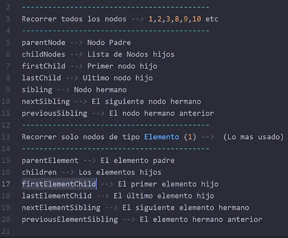
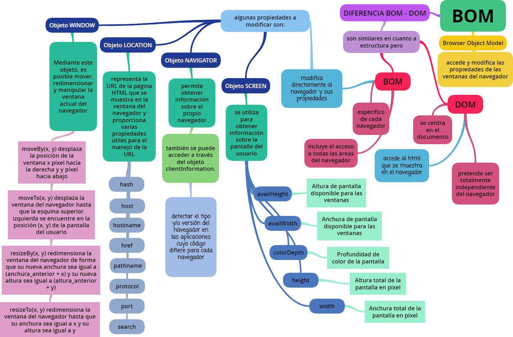
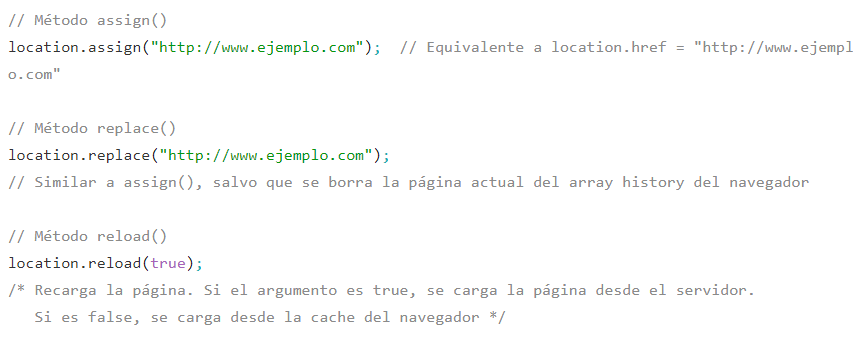

# **DOM**
1. **¿Qué es el DOM?**

 DOM transforma los documentos XHTML en un conjunto de nodos, que están interconectados y representan los contenidos de las páginas web y las relaciones entre ellos ("árbol de nodos").

 El Modelo de Objetos de Documentos (DOM) es una plataforma y una interfaz de lenguaje neutral que permite que los programas y scripts accedan y actualicen dinámicamente el contenido, la estructura y el estilo de un documento.

2. **¿Qué es un selector?**

  Es el nexo de unión entre la hoja de estilos (css) y los documentos a los que se aplique dicha hoja (DOM"index").

3. **¿Cuál es la diferencia entre *document.getElementById* y *document.getElementsByClassName*?**

  El método getElementById () devuelve el elemento que tiene el atributo ID con el valor especificado.

  El método getElementsByClassName () devuelve una colección de todos los elementos en el documento con el nombre de clase especificado, como un objeto NodeList.

4. **¿Cómo preguntamos por los hijos de un elemento usando el DOM?**

  Usando childNodes (document.childNodes).

5. **¿Cómo preguntamos por el padre de un elemento usando el DOM?**

  Usando parentNode o nodeType.

6. **¿Qué atributos CSS de un elemento se pueden modificar usando el DOM?**

  Se puede usar anteponiendo la palabra ancla. (ancla.style.fontFamily = 'sans-serif';).

7. **¿Cómo podemos simular animación entre elementos HTML?**

  
***

# **BOM**
(*Browser Object Model*)

1. **¿Qué es el BOM?**

  Permite acceder y modificar las propiedades de las ventanas del propio navegador.

  Es posible redimensionar y mover la ventana del navegador, modificar el texto que se muestra en la barra de estado y realizar muchas otras manipulaciones no relacionadas con el contenido de la página HTML.

2. **¿En qué se relaciona el DOM con el BOM?**

  Son propiedades tanto del objeto window como del objeto document.

  * **El objeto Location**:

      Representa la URL de la página HTML y proporciona propiedades útiles para el manejo de la URL.

      

  * **El objeto Navigator**:

    Se emplea para detectar el tipo y/o versión del navegador en las aplicaciones cuyo código difiere para cada navegador. Además, se emplea para detectar si el navegador tiene habilitadas las cookies, Java y también para comprobar los plugins disponibles en el navegador.

  * **El objeto Screen**:

    Se utiliza para obtener información sobre la pantalla del usuario. Uno de los datos más importantes que proporciona el objeto screen es la resolución del monitor en el que se están visualizando las páginas. Los diseñadores de páginas web necesitan conocer las resoluciones más utilizadas por los usuarios para adaptar sus diseños a esas resoluciones.

3. **¿Cuáles son algunos usos comunes del BOM?**
